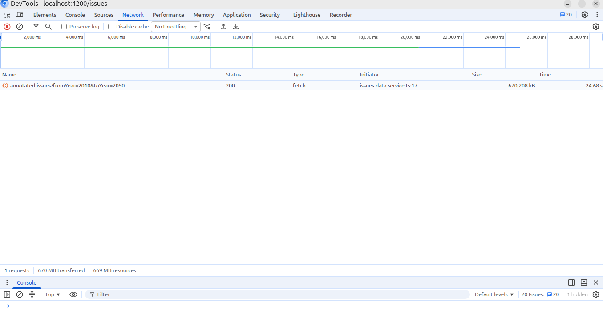
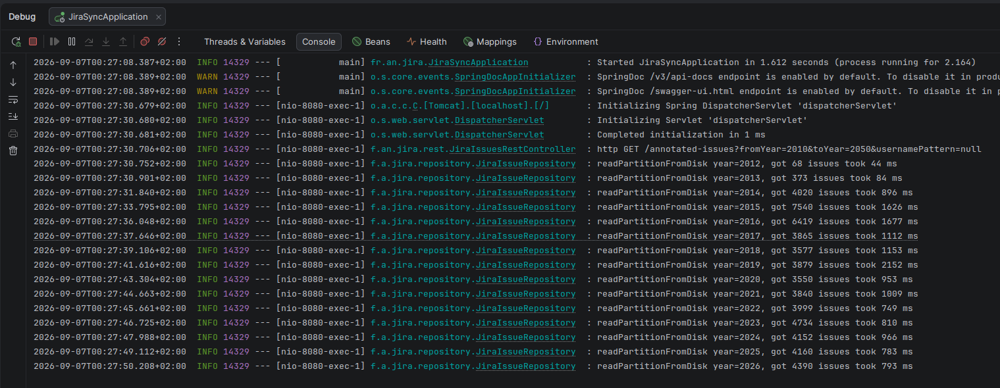
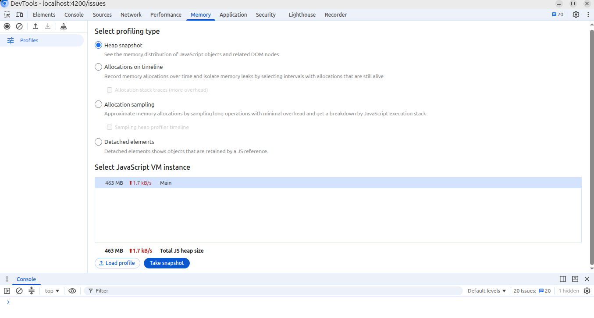
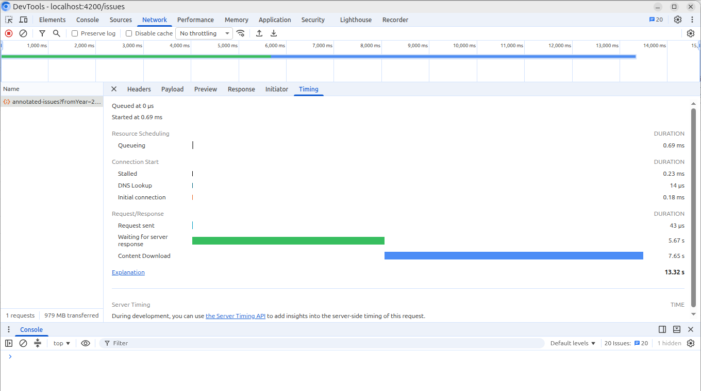
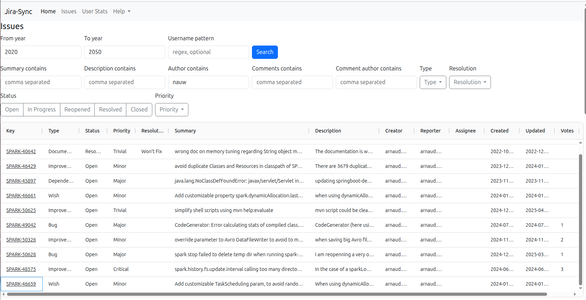
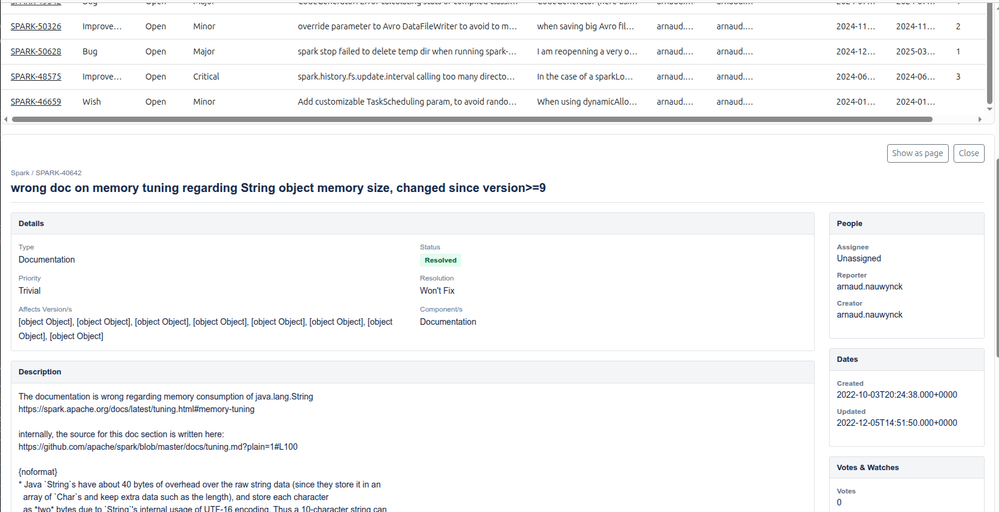
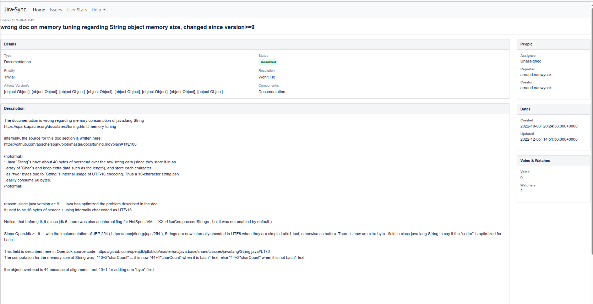
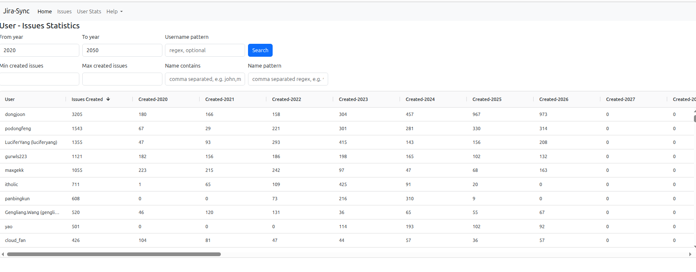
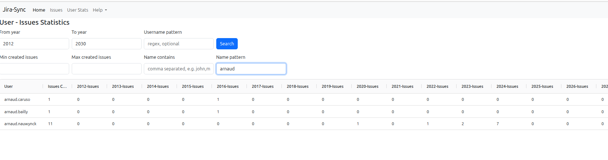

# Jira Synchronization to cached local files

Goal: synchronize on demand all new/updates Jira Issues of a project,
to be able to query issues fast, using statistics, ag-grid search/sort/filter, etc

# Performances

It is very fast to query, and then all browsing search are blazing fast!

The first time, data parse local files, and they are then cached (both server-side and client side)

ag-grid contains all issues ( ~55 000) in-memory, which only represents ~400 Mo of heap

Reloading on client takes ~14s

# Screenshots

Master-Detail 

Showing issue as page

User statistics for creating Issues (sorted per total count, descending)

filtering on username
